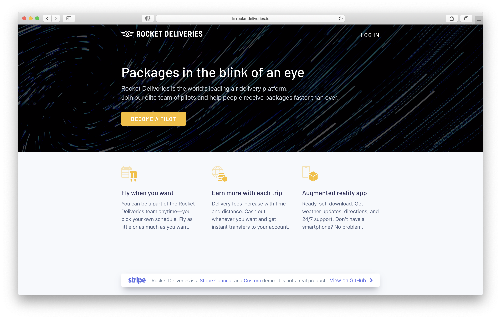
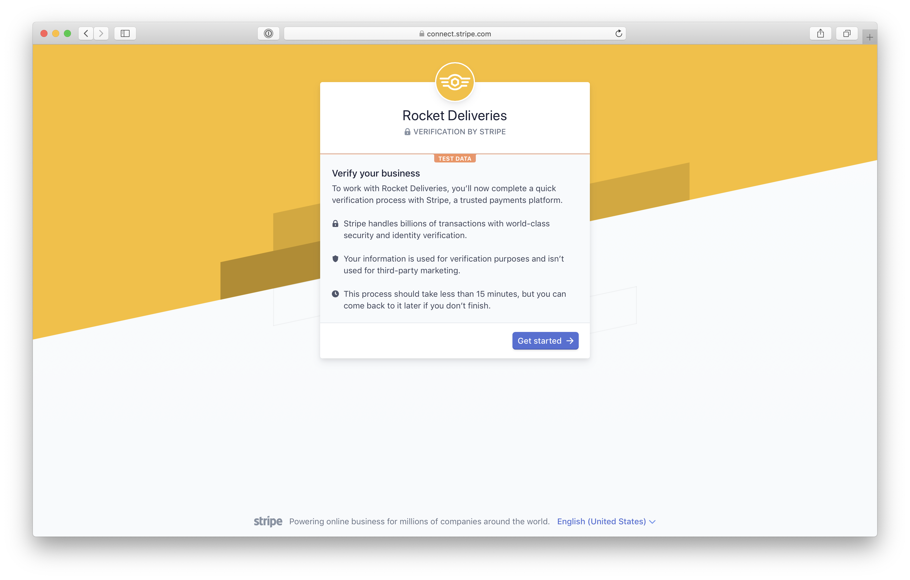

# Rocket Deliveries: Stripe Connect Custom demo

Rocket Deliveries is a sample on-demand platform that offers passengers rides with pilots, built on top of [Stripe Connect](https://stripe.com/connect), [Connect Custom](https://stripe.com/connect/custom), and [Connect Onboarding for Custom Accounts](https://stripe.com/docs/connect/connect-onboarding). 

**You can try the web app live on [rocketdeliveries.io](https://rocketdeliveries.io).**

This repository contains a [web server in Node.js](#web-onboarding-for-pilots) to onboard pilots and get them paid. [Rocket Rides](https://github.com/stripe/stripe-connect-rocketrides) is a companion demo that uses [Connect Express](https://stripe.com/connect/express) to provide simple onboarding, a hosted dashboard, verification, and payouts management.

## Web onboarding for pilots

Rocket Deliveries showcases how to sign up pilots and use [Connect Custom accounts](https://stripe.com/connect/account-types) to get them paid. Custom allows you to control every part of the user experience; accounts can be created directly via the Stripe API. This demo also uses [Connect Onboarding]((https://stripe.com/docs/connect/connect-onboarding)) to provide onboarding and identity verification for your platform, and we've customized Connect Onboarding with Rocket Deliveries branding.

This platform also uses the Stripe API to create payments for pilots, fetch their available and pending balance, and let them view transfers. It also creates [Instant Payouts](https://stripe.com/docs/connect/payouts#instant-payouts) for pilots who use a debit card as their payout account.



To integrate Stripe Connect in your own app, check out these two files in particular:
1. [`routes/pilots/stripe.js`](routes/pilots/stripe.js) shows how to easily create Connect Custom accounts and interact with the Stripe API.
2. [`routes/pilots/pilots.js`](routes/pilots/pilots.js) shows how to create payments going straight to pilots.

### Requirements

You'll need a Stripe account to manage pilot onboarding and payments. [Sign up for free](https://dashboard.stripe.com/register), then [enable Connect](https://dashboard.stripe.com/account/applications/settings) by filling in your Platform Settings. In the Development section, enter the following in the Redirect URIs field: `http://localhost:3000/pilots/stripe/token`.

For Instant Payouts to work, you'll need to [turn off automatic payouts](https://dashboard.stripe.com/account/payouts) in your settings.

You'll need to have [Node.js](http://nodejs.org) >= 7.x and [MongoDB](http://mongodb.org) installed to run this app. Using Homebrew, you can install mongodb:

    brew tap mongodb/brew
    brew install mongodb-community

### Getting started

Install dependencies using npm (or yarn):

    cd server
    npm install

Copy the configuration file and add your own [Stripe API keys](https://dashboard.stripe.com/account/apikeys) and [client ID](https://dashboard.stripe.com/account/applications/settings):

    cp config.default.js config.js

Make sure MongoDB is running. If you're using Homebrew on macOS:

    brew services start mongodb-community

Run the app:

    npm start

Go to http://localhost:3000 in your browser to start using the app.

### Use the Stripe CLI to receive webhook events

Rocket Deliveries relies on webhook events to receive updates from Stripe on a pilot's verification. Webhook events require a public domain, but to quickly get started in a local development environment you can use the [Stripe CLI](https://github.com/stripe/stripe-cli).

Install the Stripe CLI. If you're using Homebrew on macOS:

    brew install stripe/stripe-cli/stripe

Start the Rocket Deliveries server, then listen for webhook events and forward them to the server:

    stripe listen --forward-to localhost:3000/pilots/stripe/webhooks

## Rocket Rides

This project is a fork of [Rocket Rides](https://github.com/stripe/stripe-connect-rocketrides), our Connect Express demo that walks through how Express provides onboarding, account management, an account dashboard, and identity verification for platforms. To merge the latest changes from Rocket Rides:

```
# Add the upstream repository
git remote add upstream https://github.com/stripe/stripe-connect-rocketrides

# Merge upstream changes into this repository
git fetch upstream
git checkout master
git rebase -i upstream/master
```

## Credits

* Code: [Romain Huet](https://twitter.com/romainhuet), [Joey Dong](https://twitter.com/joeydong_), and [Michael Glukhovsky](https://twitter.com/mglukhovsky)
* Design: [Wes Mitchell](https://wes.ly/), [Bill Labus](https://twitter.com/billlabus), [Melissa Cameron](https://twitter.com/melissacameron_), and [Priidu Zilmer](https://zilmer.com/)
* Original logo: [Focus Lab](https://thenounproject.com/term/comet/547848/)
